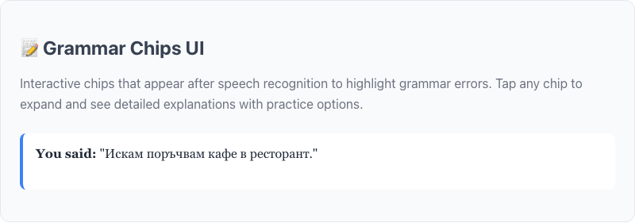
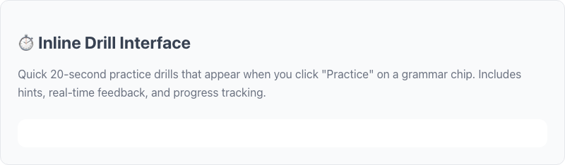
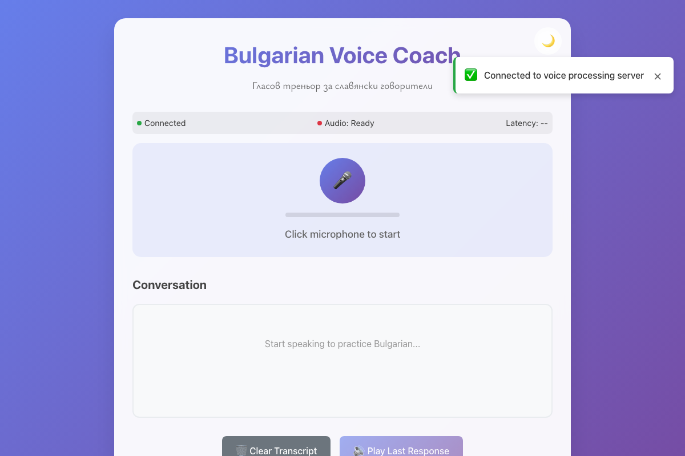

# Bulgarian Voice Coach

A voice-enabled web application for teaching Bulgarian to Slavic speakers, featuring real-time speech recognition,
grammar correction, and text-to-speech feedback.

## Features

- 🎤 **Real-time Speech Recognition** - Uses faster-whisper with VAD for accurate Bulgarian transcription
- 🗣️ **Text-to-Speech** - eSpeak-NG for Bulgarian pronunciation (upgradeable to Piper)
- 📝 **Grammar Correction** - Detects common mistakes made by Slavic speakers
- 🎯 **Spaced Repetition** - SRS system for grammar drills and exercises
- 🔤 **Bulgarian Typography** - Proper Cyrillic rendering with Ysabeau font
- 💬 **AI Coaching** - Conversational practice with Claude/OpenAI integration
- 🎨 **Interactive UI Components** - Grammar chips and drill interfaces for immediate feedback

## UI Components

### Grammar Chips UI

Interactive grammar correction visualization that appears after speech recognition. Each chip represents a detected
grammar error with severity-based color coding.

**Features:**

- 🎯 **Tap-to-expand functionality** - Click any chip to see detailed explanations
- 🎨 **Severity color coding** - Minor (yellow), moderate (orange), serious (red) errors
- ⚡ **Smooth animations** - Professional transitions and micro-interactions
- 🛡️ **XSS protection** - Safe DOM manipulation prevents security issues
- 📱 **Mobile responsive** - Touch-friendly design for all devices
- 🎪 **Action buttons** - Direct access to practice drills and learning resources

 _Grammar Chips UI component demonstration showing
Bulgarian text processing_

**Example Usage:**

```javascript
// Create grammar chips from corrections
const corrections = [
  {
    type: "infinitive_usage",
    before: "искам поръчвам",
    after: "искам да поръчам",
    note: "Use да + present tense",
    error_tag: "bg.no_infinitive.da_present",
  },
];

window.grammarChipsUI.createChips(corrections, container);
```

### Inline Drill Interface

Quick 20-second practice drills that help users master grammar concepts through immediate practice.

**Features:**

- ⏱️ **20-second timer** - Quick, focused practice sessions
- 💡 **Hint system** - Progressive hints to guide learning
- 📊 **Real-time feedback** - Instant validation with visual indicators
- 🎯 **Progress tracking** - Records performance and completion metrics
- 🔄 **Seamless integration** - Triggered directly from grammar chips
- 🎨 **Visual feedback** - Color-coded responses for correct/incorrect answers

 _Inline Drill Interface component for quick
grammar practice sessions_

**Example Usage:**

```javascript
// Create practice drill
const drill = {
  prompt_bg: "Complete: Искам ___ поръчам кафе",
  answer_bg: "да",
  note: 'Bulgarian uses "да" + present tense',
};

window.inlineDrillInterface.createInlineDrill(drill, container);
```

### Live Application Interface

The complete voice coaching workflow integrating speech recognition, grammar detection, and interactive learning
components.

 _Main voice coaching interface with microphone controls and transcript
display_

 _Complete workflow from speech input to grammar
correction and practice_

### Component Architecture

The UI components use a modern, event-driven architecture:

```javascript
// Event-driven communication between components
window.addEventListener("grammar-practice-requested", e => {
  const correction = e.detail.correction;
  // Launch practice drill for specific grammar error
});

window.addEventListener("drill-completed", e => {
  const result = e.detail;
  // Update SRS system with practice results
});
```

**Key Design Principles:**

- **Progressive Enhancement** - Works without JavaScript, enhanced with it
- **Accessibility First** - Screen reader compatible, keyboard navigation
- **Performance Optimized** - Minimal DOM manipulation, efficient animations
- **Cross-browser Compatible** - Works on Chrome 64+, Firefox 76+, Safari 14.1+
- **Secure by Default** - XSS protection, safe HTML rendering

### Testing Coverage

Both UI components are thoroughly tested with comprehensive test suites:

- **Grammar Chips UI**: 34 tests covering initialization, chip creation, interactions, XSS protection, and edge cases
- **Inline Drill Interface**: 41 tests covering drill creation, answer validation, timer functionality, and progress
  tracking
- **Total Coverage**: 75 passing tests ensuring reliability and robustness

```bash
# Run the UI component tests
cd client && npm test

# View UI components demo
open demo-components.html
# or serve via: python3 -m http.server 8080
```

## Tech Stack

**Backend:**

- Python 3.11 with FastAPI
- faster-whisper (CTranslate2) for ASR
- eSpeak-NG for TTS
- WebSocket for real-time communication

**Frontend:**

- Vanilla JavaScript with Vite
- AudioWorklet for low-latency audio processing
- Modern CSS with Bulgarian typography support

**Grammar Engine:**

- Lightweight rule-based Bulgarian grammar detection
- Focus on definite articles, infinitive constructions, future tense, clitics

## Prerequisites

1. **Python 3.11** or later
2. **Node.js 18** or later
3. **eSpeak-NG** - Install via package manager:

   ```bash
   # Ubuntu/Debian
   sudo apt-get install espeak-ng

   # macOS
   brew install espeak-ng

   # Windows (via Chocolatey)
   choco install espeak-ng
   ```

4. **just** command runner

## Quick Start

1. **Clone and setup:**

   ```bash
   git clone <repository-url>
   cd bulgarian-app
   just install
   ```

2. **Configure environment** (optional):

   ```bash
   cp .env.example .env
   # Edit .env with your API keys and model paths
   ```

3. **Run development servers:**

   ```bash
   just dev
   ```

4. **Open browser:**
   - Frontend: <http://localhost:3000>
   - Backend API: <http://localhost:8000>

## Configuration

Create a `.env` file in the project root:

```bash
# Whisper model path (or leave blank for auto-download)
WHISPER_MODEL_PATH=medium

# Chat provider (auto, openai, claude, dummy)
CHAT_PROVIDER=auto

# API keys (only if using hosted LLMs)
OPENAI_API_KEY=your_openai_key_here
ANTHROPIC_API_KEY=your_claude_key_here
```

## Content Files

The app expects these content files in `server/content/`:

- `bg_grammar_pack.json` - Grammar rules and exercises
- `bg_scenarios_with_grammar.json` - Practice scenarios

Sample files are auto-generated if missing. For production, provide your own content files.

## Development Commands

```bash
# Install dependencies
just install

# Run development servers (FastAPI + Vite)
just dev

# Run linting
just lint

# Format code
just format

# Run tests
just test

# Production-like serve
just serve

# Capture screenshots for documentation
just screenshots
```

## Grammar Detection

The app detects common Bulgarian grammar errors made by Slavic speakers:

### Definite Articles

- **Issue:** Missing or incorrect postposed articles (-ът, -та, -то, -те)
- **Example:** "стол" → "столът" (when referring to a specific chair)

### No Infinitive Construction

- **Issue:** Using infinitive-like forms instead of "да" + present
- **Example:** "Искам поръчвам" → "Искам да поръчам"

### Future Tense

- **Issue:** Missing "ще" for future actions
- **Example:** "Утре ходя" → "Утре ще ходя"

### Clitic Positioning

- **Issue:** Incorrect placement of clitic pronouns
- **Example:** Proper positioning after "не" and certain particles

## Audio Configuration

### Sample Rates

- **Input:** 48kHz (browser default) → resampled to 16kHz
- **Processing:** 16kHz mono PCM Int16 frames
- **Output:** 22kHz (eSpeak default)

### Latency Budget

- 20-40ms frames → 200-400ms VAD → 0.5-1.0s ASR → ~0.2s TTS
- **Target:** 1.2-2.0s total latency

### Browser Support

- **Primary:** AudioWorklet (Chrome 64+, Firefox 76+, Safari 14.1+)
- **Fallback:** ScriptProcessor for older browsers

## Typography

Bulgarian text uses the **Ysabeau** font family optimized for Cyrillic:

1. Download Ysabeau font files from [Google Fonts](https://fonts.google.com/specimen/Ysabeau)
2. Place in `client/assets/fonts/`
3. Bulgarian text automatically uses proper typography with `:lang(bg)` and `.bg-text`

## Deployment

### Production Build

```bash
# Build frontend
cd client && npm run build

# Serve with production settings
just serve
```

### Docker (Optional)

```dockerfile
FROM python:3.11-slim
RUN apt-get update && apt-get install -y espeak-ng
COPY . /app
WORKDIR /app
RUN pip install -r server/requirements.txt
EXPOSE 8000
CMD ["python", "-m", "uvicorn", "app:app", "--host", "0.0.0.0"]
```

### Environment Variables

- `WHISPER_MODEL_PATH` - Path to Whisper model or model name
- `CHAT_PROVIDER` - LLM provider (auto/openai/claude/dummy)
- `OPENAI_API_KEY` - OpenAI API key (if using)
- `ANTHROPIC_API_KEY` - Claude API key (if using)

## Contributing

1. Follow the existing code style (Black, isort, Ruff for Python; Prettier for JS)
2. Run `just lint` before committing
3. Add tests for new features
4. Update documentation as needed

### Code Style

- **Python:** Black formatting, isort imports, Ruff linting
- **JavaScript:** Prettier formatting
- **Commits:** Conventional commits preferred

## Troubleshooting

### Common Issues

**eSpeak-NG not found:**

```bash
# Install eSpeak-NG for your system
sudo apt-get install espeak-ng  # Ubuntu/Debian
brew install espeak-ng          # macOS
```

**Microphone not working:**

- Ensure HTTPS in production (required for getUserMedia)
- Check browser permissions
- Test with different browsers

**WebSocket connection fails:**

- Check if backend is running on port 8000
- Verify firewall settings
- Check proxy configuration in `vite.config.js`

**Audio quality issues:**

- Verify 16kHz processing chain
- Check VAD sensitivity settings
- Test with different microphones

### Performance Tuning

**ASR Latency:**

- Use smaller Whisper model (tiny/base vs medium/large)
- Adjust VAD parameters
- Reduce beam size and temperature

**Memory Usage:**

- Monitor Whisper model size
- Adjust audio buffer sizes
- Use model quantization (int8/int16)

## License

[Add your license here]

## Acknowledgments

- **faster-whisper** - Fast Whisper implementation
- **eSpeak-NG** - Open source speech synthesis
- **Ysabeau** - Cyrillic typography by Catharsis Fonts
- **FastAPI** - Modern Python web framework
- **Vite** - Fast frontend build tool
